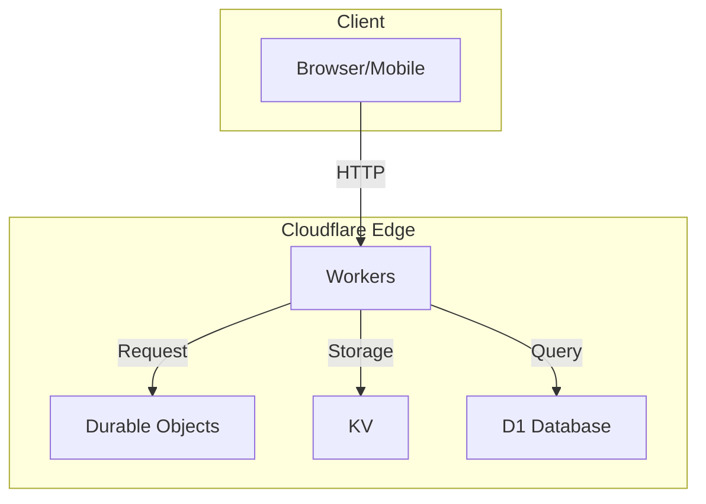
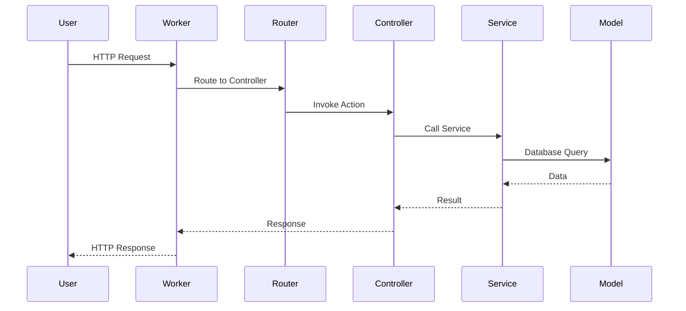
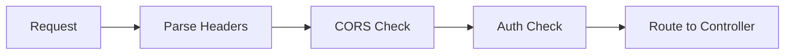
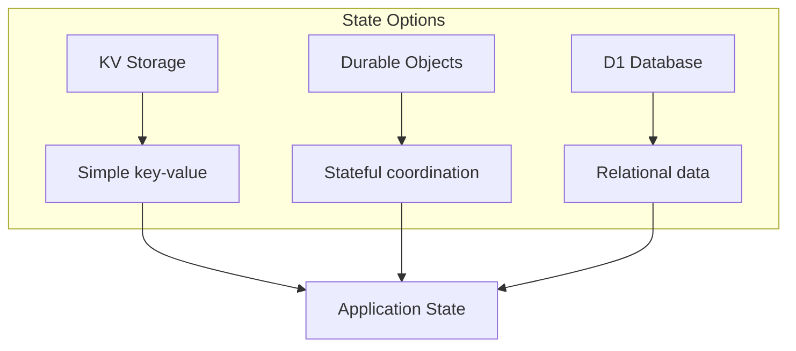
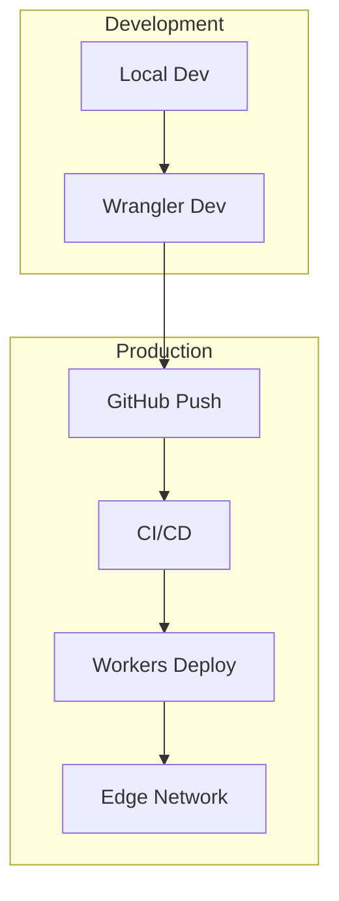

# Architecture

Nomo follows a layered architecture pattern for building serverless applications on Cloudflare Workers.

## Overview



## Request Flow



## Layers

### 1. Entrypoints
Entrypoints handle incoming HTTP requests at the edge.



### 2. Controllers
Controllers contain business logic and orchestrate services.

```typescript
export class UsersController extends BaseController {
  protected service = userService;

  async index() {
    const users = await this.service.list();
    return this.json(users);
  }
}
```

### 3. Services
Services handle external integrations and business rules.

```typescript
export class UserService extends BaseService {
  async list(): Promise<User[]> {
    return this.model.query().all();
  }
}
```

### 4. Models
Models define data structures and handle database operations.

```typescript
export class UserModel extends BaseModel {
  table = users;
  
  async findByEmail(email: string) {
    return this.query().where({ email }).first();
  }
}
```

## State Management



### KV Storage
Best for caching and simple key-value data.

### Durable Objects
Best for stateful coordination, WebSockets, and real-time features.

### D1 Database
Best for persistent relational data.

## Deployment Architecture



## Best Practices

1. **Keep Controllers thin** - Delegate business logic to services
2. **Use Models for data** - Encapsulate database operations
3. **Leverage Durable Objects** - For stateful workloads
4. **Use KV for caching** - Reduce database load
5. **Process async with Queues** - Handle background jobs