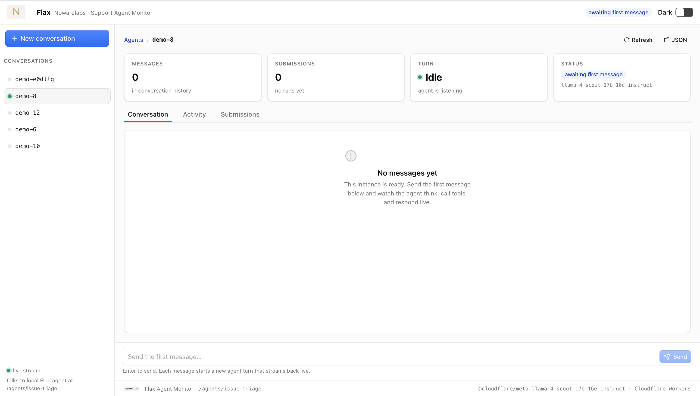

# Flax — SDLC Multi-Agent System on Cloudflare Workers

A scaffolded multi-agent software-development-lifecycle (SDLC) system built as a
pnpm monorepo of independent Cloudflare Workers.



- **Every tool is its own Worker** (`packages/tools/<tool-name>/`) exposing a
  `WorkerEntrypoint` subclass whose public methods are the RPC surface.
- **Every agent is its own Worker** (`packages/agents/<agent-name>/`) built on
  [Flue](https://github.com/flue): a `'use agent'` function, Hono `app.ts` router,
  skills as `SKILL.md` files, and service-bound tools exposed to the model via
  `defineTool` wrappers.
- Agents reach tools **only** through service bindings to those RPC entrypoints —
  never via direct `fetch()` to an external API.
- Shared tools are built once and bound into every agent that needs them.
- Every agent worker shares one D1 database (`support-agent-db`) and the Workers
  AI binding; each agent's durable state lives in its own Flue Durable Object.

`github-tool` and `jira-linear-tool` are implemented end-to-end. The other tool
methods are stubs that `throw new Error("not implemented")`.

## Repository layout

```
packages/agents/          # 16 agent workers (Flue agents: skills + tools + role)
packages/agents/support-agent/   # the reference Flue agent (support / issue triage)
packages/tools/           # 37 tool workers (RPC entrypoints, stub methods)
packages/dashboard/       # conversation-first dashboard SPA (React 19 + Vite + Kumo)
packages/dashboard-api/   # dashboard backend: REST API, D1 schema, GitHub App auth, SPA host
```

## Dashboard

A conversation-first human interface for the Flax build system. The dashboard
(`packages/dashboard/`) talks to a single backend worker
(`packages/dashboard-api/`) that:

- **Inbox** (`/`) — lists every conversation in D1 (`flax_instances`), starts new
  ones (create + dispatch to the orchestrator), filters by status, and shows the
  agent roster strip.
- **Conversation** (`#/conversations/:id`) — Chat, Pipeline, and Artifacts tabs:
  - **Chat** streams the orchestrator's conversation live (Flue SSE) and renders
    pending HITL widgets inline.
  - **Pipeline** renders the 10-stage build rail
    (`requirements → architecture → design → coding → review → qa → security →
devops → release → sre-docs`) with a stage log.
  - **Artifacts** lists PRs, issues, docs, diagrams and reports extracted from
    tool outputs.
- **HITL widgets** (`src/hitl.tsx`) — reusable decision cards: `approve-reject`,
  `choose-option`, `pr-review` (approve-and-merge through github-tool),
  `structured-form`, and `alert`. Resolving one writes the resolution to D1 and
  unblocks the orchestrator with a `[HITL resolved]` message.
- **Setup** (`#/setup`) — first-run GitHub App connection via the App Manifest
  flow (with a manual credential form + installation-id fallback).

Telemetry is written both live (the orchestrator's `app.ts` middleware patches
`title/status/current_stage/last_activity_at` on every request, and its
`dispatch_agent` / `request_human_input` tools record `flax_stages` /
`flax_hitl`) and via a rescan (`POST /api/conversations/:id/scan`) that replays
the orchestrator history. `github-tool` authenticates with an App installation
token minted from the stored App credentials (cached in D1), falling back to a
`GITHUB_TOKEN` PAT.

## Binding graph

Each agent's `wrangler.jsonc` declares `services` bindings (env binding →
service → entrypoint). The orchestrator additionally binds to every other agent.

| Agent                        | Tool bindings                                                                            | Agent bindings                                                                                                                                                                                                                                                                                                                                                             |
| ---------------------------- | ---------------------------------------------------------------------------------------- | -------------------------------------------------------------------------------------------------------------------------------------------------------------------------------------------------------------------------------------------------------------------------------------------------------------------------------------------------------------------------- |
| product-requirements-agent   | `JIRA_LINEAR_TOOL`, `CONFLUENCE_NOTION_TOOL`, `TRANSCRIPTION_TOOL`, `VECTOR_STORE_TOOL`  | —                                                                                                                                                                                                                                                                                                                                                                          |
| business-data-analyst-agent  | `WEB_SEARCH_TOOL`, `ANALYTICS_TOOL`, `DB_CLIENT_TOOL`                                    | —                                                                                                                                                                                                                                                                                                                                                                          |
| solutions-architect-agent    | `DIAGRAMMING_TOOL`, `CLOUD_PRICING_TOOL`, `IAC_TOOL`                                     | —                                                                                                                                                                                                                                                                                                                                                                          |
| ux-ui-designer-agent         | `FIGMA_TOOL`, `IMAGE_GEN_TOOL`, `ACCESSIBILITY_CHECKER_TOOL`                             | —                                                                                                                                                                                                                                                                                                                                                                          |
| coding-agent                 | `GITHUB_TOOL`, `PACKAGE_MANAGER_TOOL`, `LINT_LANGSERVER_TOOL`, `SANDBOX_EXEC_TOOL`       | —                                                                                                                                                                                                                                                                                                                                                                          |
| database-data-engineer-agent | `DB_CLIENT_TOOL`, `MIGRATIONS_TOOL`, `QUERY_PROFILER_TOOL`                               | —                                                                                                                                                                                                                                                                                                                                                                          |
| code-review-agent            | `GITHUB_TOOL`, `STATIC_ANALYSIS_TOOL`, `CI_STATUS_TOOL`                                  | —                                                                                                                                                                                                                                                                                                                                                                          |
| qa-test-agent                | `TEST_RUNNER_TOOL`, `CI_STATUS_TOOL`, `COVERAGE_TOOL`                                    | —                                                                                                                                                                                                                                                                                                                                                                          |
| security-appsec-agent        | `SECURITY_SCAN_TOOL`, `SBOM_TOOL`, `PENTEST_TOOL`                                        | —                                                                                                                                                                                                                                                                                                                                                                          |
| devops-cicd-agent            | `CICD_PIPELINE_TOOL`, `CONTAINERS_TOOL`, `IAC_TOOL`                                      | —                                                                                                                                                                                                                                                                                                                                                                          |
| release-manager-agent        | `FEATURE_FLAGS_TOOL`, `GITHUB_TOOL`, `CHANGELOG_TOOL`                                    | —                                                                                                                                                                                                                                                                                                                                                                          |
| sre-observability-agent      | `MONITORING_TOOL`, `PAGERDUTY_TOOL`, `LOG_AGGREGATION_TOOL`                              | —                                                                                                                                                                                                                                                                                                                                                                          |
| documentation-agent          | `DOCS_GENERATOR_TOOL`, `CONFLUENCE_NOTION_TOOL`                                          | —                                                                                                                                                                                                                                                                                                                                                                          |
| support-feedback-agent       | `SUPPORT_TICKETS_TOOL`, `SENTIMENT_ANALYSIS_TOOL`, `JIRA_LINEAR_TOOL`                    | —                                                                                                                                                                                                                                                                                                                                                                          |
| support-agent                | `JIRA_LINEAR_TOOL`, `SUPPORT_TICKETS_TOOL`, `SENTIMENT_ANALYSIS_TOOL`, `WEB_SEARCH_TOOL` | —                                                                                                                                                                                                                                                                                                                                                                          |
| orchestrator-agent           | `TASK_QUEUE_TOOL`, `JIRA_LINEAR_TOOL`                                                    | `PRODUCT_REQUIREMENTS_AGENT`, `BUSINESS_DATA_ANALYST_AGENT`, `SOLUTIONS_ARCHITECT_AGENT`, `UX_UI_DESIGNER_AGENT`, `CODING_AGENT`, `DATABASE_DATA_ENGINEER_AGENT`, `CODE_REVIEW_AGENT`, `QA_TEST_AGENT`, `SECURITY_APPSEC_AGENT`, `DEVOPS_CICD_AGENT`, `RELEASE_MANAGER_AGENT`, `SRE_OBSERVABILITY_AGENT`, `DOCUMENTATION_AGENT`, `SUPPORT_FEEDBACK_AGENT`, `SUPPORT_AGENT` |

### Shared tools

Tools reused by multiple agents: `github-tool` (coding, code-review, devops-cicd,
release-manager), `iac-tool` (solutions-architect, devops-cicd),
`db-client-tool` (business-data-analyst, database-data-engineer), `ci-status-tool`
(code-review, qa-test), `jira-linear-tool` (product-requirements, support-feedback,
orchestrator), `confluence-notion-tool` (product-requirements, documentation).

## Tool registry

Every tool worker exports a `WorkerEntrypoint` subclass named `PascalCase` after
the tool (`GithubTool`, `TestRunnerTool`, ...). Method names are stubbed per the
registry below.

| Tool                       | Entrypoint                 | Stub methods                                                                                                                                |
| -------------------------- | -------------------------- | ------------------------------------------------------------------------------------------------------------------------------------------- |
| jira-linear-tool           | `JiraLinearTool`           | `createIssue`, `updateIssue`, `getBacklog`, `prioritizeBacklog`                                                                             |
| confluence-notion-tool     | `ConfluenceNotionTool`     | `createPage`, `updatePage`, `searchPages`                                                                                                   |
| transcription-tool         | `TranscriptionTool`        | `transcribeAudio`, `summarizeCall`                                                                                                          |
| vector-store-tool          | `VectorStoreTool`          | `upsert`, `query`, `delete`                                                                                                                 |
| web-search-tool            | `WebSearchTool`            | `search`, `fetchPage`                                                                                                                       |
| analytics-tool             | `AnalyticsTool`            | `getFunnel`, `getCohort`, `queryEvent`                                                                                                      |
| db-client-tool             | `DbClientTool`             | `query`, `execute`                                                                                                                          |
| diagramming-tool           | `DiagrammingTool`          | `generateDiagram`, `exportDiagram`                                                                                                          |
| cloud-pricing-tool         | `CloudPricingTool`         | `estimateCost`, `compareInstanceTypes`                                                                                                      |
| iac-tool                   | `IacTool`                  | `planTerraform`, `applyTerraform`, `getState`                                                                                               |
| figma-tool                 | `FigmaTool`                | `getFile`, `createFrame`, `exportAssets`                                                                                                    |
| image-gen-tool             | `ImageGenTool`             | `generateImage`                                                                                                                             |
| accessibility-checker-tool | `AccessibilityCheckerTool` | `auditPage`, `auditComponent`                                                                                                               |
| github-tool                | `GithubTool`               | `createPullRequest`, `getPullRequest`, `mergePullRequest`, `getIssue`, `createBranch`, `commitFiles`, `createTag`, `getDiff`, `getCiStatus` |
| package-manager-tool       | `PackageManagerTool`       | `installDependency`, `updateDependency`, `auditDependencies`                                                                                |
| lint-langserver-tool       | `LintLangserverTool`       | `lintFile`, `formatFile`, `getDiagnostics`                                                                                                  |
| sandbox-exec-tool          | `SandboxExecTool`          | `runCommand`, `runInSandbox`                                                                                                                |
| migrations-tool            | `MigrationsTool`           | `createMigration`, `runMigration`, `rollbackMigration`                                                                                      |
| query-profiler-tool        | `QueryProfilerTool`        | `explainQuery`, `profileQuery`                                                                                                              |
| static-analysis-tool       | `StaticAnalysisTool`       | `analyzeCode`, `getCodeSmells`                                                                                                              |
| ci-status-tool             | `CiStatusTool`             | `getBuildStatus`, `getTestResults`                                                                                                          |
| test-runner-tool           | `TestRunnerTool`           | `runUnitTests`, `runIntegrationTests`, `runE2eTests`, `generateTestData`                                                                    |
| coverage-tool              | `CoverageTool`             | `getCoverageReport`                                                                                                                         |
| security-scan-tool         | `SecurityScanTool`         | `runSast`, `runDast`, `scanDependencies`, `scanSecrets`                                                                                     |
| sbom-tool                  | `SbomTool`                 | `generateSbom`                                                                                                                              |
| pentest-tool               | `PentestTool`              | `runPentestSuite`                                                                                                                           |
| cicd-pipeline-tool         | `CicdPipelineTool`         | `triggerPipeline`, `getPipelineStatus`, `provisionEnvironment`                                                                              |
| containers-tool            | `ContainersTool`           | `buildImage`, `deployToK8s`, `getDeploymentStatus`                                                                                          |
| feature-flags-tool         | `FeatureFlagsTool`         | `createFlag`, `toggleFlag`, `getRolloutStatus`                                                                                              |
| changelog-tool             | `ChangelogTool`            | `generateChangelog`, `getVersionHistory`                                                                                                    |
| monitoring-tool            | `MonitoringTool`           | `getMetrics`, `getDashboard`, `createAlert`                                                                                                 |
| pagerduty-tool             | `PagerdutyTool`            | `createIncident`, `getOnCall`, `resolveIncident`                                                                                            |
| log-aggregation-tool       | `LogAggregationTool`       | `queryLogs`, `tailLogs`                                                                                                                     |
| docs-generator-tool        | `DocsGeneratorTool`        | `generateApiDocs`, `buildDocsSite`                                                                                                          |
| support-tickets-tool       | `SupportTicketsTool`       | `getTickets`, `createBacklogItemFromTicket`                                                                                                 |
| sentiment-analysis-tool    | `SentimentAnalysisTool`    | `analyzeSentiment`, `clusterFeedback`                                                                                                       |
| task-queue-tool            | `TaskQueueTool`            | `enqueueTask`, `getTaskStatus`, `assignTask`                                                                                                |

## Agent structure

Each agent worker is a Flue app:

- `src/agents/<name>.ts` — the `'use agent'` function: `useModel()`, `useSkill()`
  for each `SKILL.md`, `useTool()` for each service-bound tool, and the returned
  role prompt.
- `src/skills/<skill-name>/SKILL.md` — Agent Skills format (frontmatter `name` +
  `description`, instructions in the body; progressive disclosure).
- `src/tools/<tool-name>.ts` — a `defineTool` wrapper that calls the tool worker's
  RPC methods via its `env` service binding.
- `src/app.ts` — Hono app mounting `createAgentRouter` at `/agents/<name>`, with a
  best-effort registry of conversation ids in the shared D1 `flax_instances` table.

The orchestrator additionally exposes a `dispatch_agent` tool that POSTs tasks to
the other agents' `/agents/<name>/<id>` endpoints over their service bindings.

## Commands

```bash
pnpm install              # link the pnpm workspace
pnpm typecheck            # tsc --noEmit across every package
pnpm dev                  # run the orchestrator agent in local dev
pnpm deploy:tools         # deploy all tool workers
pnpm deploy:agents        # deploy all agent workers (must run after tools)
pnpm deploy               # tools, then agents
```

### Dashboard local dev

```bash
# 1. build the SPA into dashboard-api/static and run the backend
pnpm --filter @nowarelabs/dashboard-api build:spa
pnpm --filter @nowarelabs/dashboard-api dev          # http://localhost:8787 (full stack: API + SPA + /agents proxy)

# or run the SPA against a live dashboard-api backend
pnpm --filter @nowarelabs/dashboard dev              # http://localhost:5173, proxies /api + /agents to :8787

pnpm --filter @nowarelabs/dashboard-api deploy       # deploy API + SPA
```

First run opens `#/setup`: create the GitHub App (App Manifest flow), install it
on your org, and the dashboard verifies the API connection. Conversations then
walk the pipeline and pause for human decisions where requested.

Per-worker commands run from the worker directory:

```bash
pnpm exec wrangler dev
pnpm exec wrangler deploy
pnpm exec wrangler deploy --dry-run   # validate config without uploading
pnpm run cf-typegen                   # regenerate worker-configuration.d.ts (typed Env) after editing wrangler.jsonc
```

## Deployment order

Tools before agents (agents' service bindings reference deployed tool workers),
orchestrator last. All workers enable Workers tracing via
`observability.traces.enabled: true` in their `wrangler.jsonc`.
